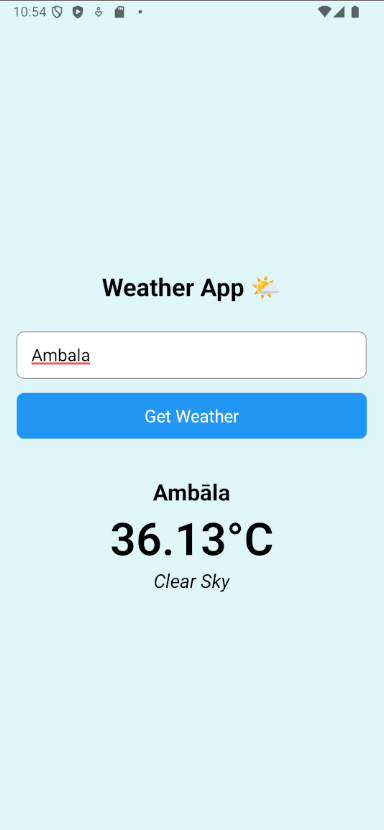

# 🌦️ React Native Weather App

   

---

## 📋 Table of Contents

- [🌦️ React Native Weather App](#️-react-native-weather-app)
  - [📋 Table of Contents](#-table-of-contents)
  - [🧠 Introduction](#-introduction)
  - [✨ Features](#-features)
  - [🧱 Folder Structure](#-folder-structure)
  - [📦 Dependencies](#-dependencies)
  - [⚙️ Installation and Setup](#️-installation-and-setup)
    - [1. Clone the repository](#1-clone-the-repository)
    - [2. Install dependencies](#2-install-dependencies)
    - [3. Start the app](#3-start-the-app)
  - [🔐 Environment Variables](#-environment-variables)
  - [📲 Usage](#-usage)
  - [🧊 Modal Component](#-modal-component)
  - [🖼️ Screenshots](#️-screenshots)
  - [📜 License](#-license)

---

## 🧠 Introduction

The **React Native Weather App** allows users to **input any city name**, fetch **live weather data** from the **OpenWeatherMap API**, and display it beautifully. Built with **Expo**, this app is beginner-friendly and a great foundation for more advanced apps.

---

## ✨ Features

- 🌐 Fetch weather by city name
- ⌨️ Input field with button
- 🧾 Displays temperature, condition, and city
- 🧠 Modular, clean, and component-based code

---

## 🧱 Folder Structure

```md
project_react-native-weather-app/
├── App.js
├── assets/
│ └── (images or icons)
├── .env
├── babel.config.js
├── package.json
└── README.md
```

---

## 📦 Dependencies

Install these before running the project:

```bash
npx expo install expo-location
npm install react-native-dotenv
```

| Package               | Purpose                             |
| --------------------- | ----------------------------------- |
| `expo-location`       | To fetch device location (optional) |
| `react-native-dotenv` | To securely load `.env` API keys    |
| `react-native`        | Core mobile development             |
| `expo`                | React Native framework & tooling    |

---

## ⚙️ Installation and Setup

### 1. Clone the repository

```bash
git clone https://github.com/Aaditya-Kumar-Mittal/project_react-native-weather-app.git
cd project_react-native-weather-app
```

### 2. Install dependencies

```bash
npm install
```

### 3. Start the app

```bash
npx expo start
```

---

## 🔐 Environment Variables

Create a `.env` file in the root:

```env
WEATHER_API_KEY=your_openweather_api_key_here
```

> Replace with your actual key from: [https://openweathermap.org/api](https://openweathermap.org/api)

---

## 📲 Usage

- Type a **city name** in the input field
- Tap the **"Get Weather"** button
- Weather information will be shown
- A **Modal** can be used to display additional data or errors elegantly

---

## 🧊 Modal Component

The app demonstrates how to use the `Modal` component from React Native:

```jsx
import { Modal, Text, View, Pressable } from "react-native";

<Modal
  animationType="slide"
  transparent={true}
  visible={modalVisible}
  onRequestClose={() => setModalVisible(false)}
>
  <View style={styles.overlay}>
    <View style={styles.modalView}>
      <Text>Weather details...</Text>
      <Pressable onPress={() => setModalVisible(false)}>
        <Text>Close</Text>
      </Pressable>
    </View>
  </View>
</Modal>;
```

---

## 🖼️ Screenshots

| Home Input                              |
| --------------------------------------- |
|  |

---

## 📜 License

This project is open source and available under the [MIT License](LICENSE).

---
